# Applied Quartermaster

An addon for [Applied Energistics 2](https://github.com/AppliedEnergistics/Applied-Energistics-2) that puts your whole ME
network in your hands. The **ME Tablet** is a handheld hub with a tab for each part of your base, and four blocks give your
guide books, weapons, tools and farms a home on the network.

> **Status: beta.** Built for **All the Mods 11** (Minecraft 26.1.2, NeoForge). Every screenshot below is real: the mod's
> automated self-test took them in game. Feedback and bug reports are welcome in [Issues](../../issues).

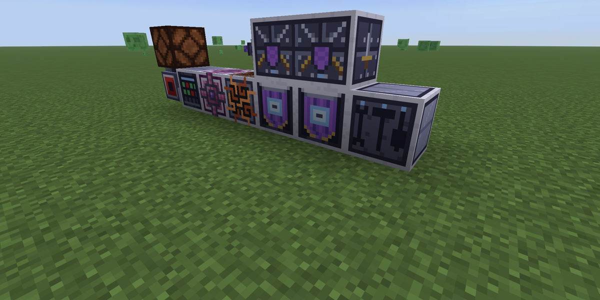

| Block or item | What it does |
| --- | --- |
| **ME Tablet** | Handheld hub: opens your AE2 terminals and has a tab for each kind of storage block on your network |
| **ME Library** | Holds 8 guide books; read them from the tablet |
| **ME Armory** | Holds 8 weapons and mining tools |
| **ME Tool Rack** | Holds 8 utility tools (wrenches, memory cards, network tools…) |
| **ME Farm Controller** | One per farm; connects the farm's own cables to your network |
| **ME Redstone Plate** | Cable part that switches a machine on and off with redstone |

## Contents

1. [Getting started](#getting-started)
2. [The ME Tablet](#the-me-tablet)
3. [ME Library](#me-library)
4. [ME Armory and ME Tool Rack](#me-armory-and-me-tool-rack)
5. [Farm automation](#farm-automation)
6. [Recipes](#recipes)
7. [In-game guide](#in-game-guide)
8. [Troubleshooting](#troubleshooting)
9. [Requirements, download and building](#requirements)

## Getting started

1. **Craft an ME Tablet** ([recipe](#recipes)).
2. **Link a wireless terminal** to your network the normal AE2 way: put an AE2 *Wireless Terminal* (or *Wireless
   Crafting Terminal*, or an AE2WTLib universal terminal) in a *Wireless Access Point*.
3. **Right-click the tablet.** It opens on the **Modules** page. Put the linked terminal in a module slot, and a tab with
   the terminal's icon appears at the top.
4. **Place your storage blocks** (ME Library, ME Armory, ME Tool Rack, ME Farm Controller) on that network. As soon as one
   is on the network, its tab appears on the tablet.

The tablet reaches the network through a powered Wireless Access Point in range, exactly like the terminal itself. Add
Wireless Boosters to the tablet for more range (see [Upgrades and battery](#upgrades-and-battery)).

## The ME Tablet

### Holding it

With your off hand empty, you hold the tablet in **both hands**, like a map, and it tilts up as you look down at it. With
something in your off hand, you hold it in one hand. Other players see you holding it up to read. In inventories it keeps
its flat icon.

<p>
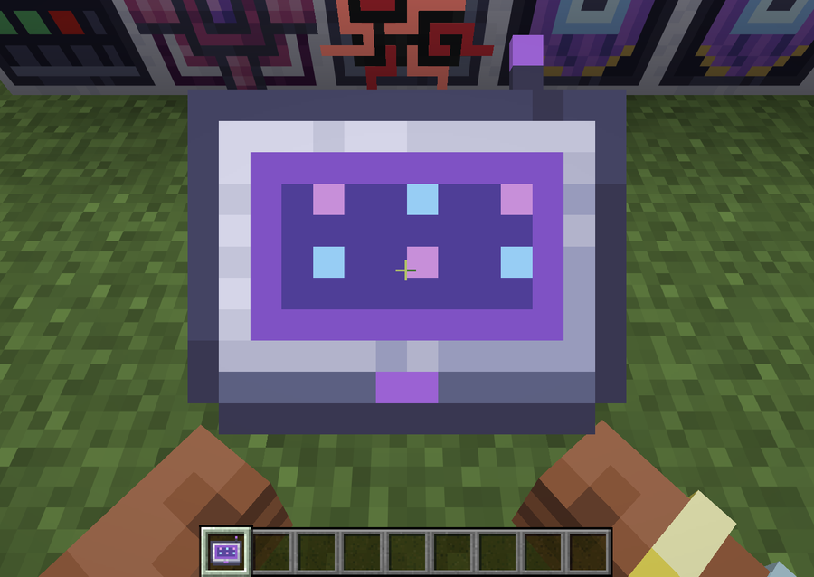
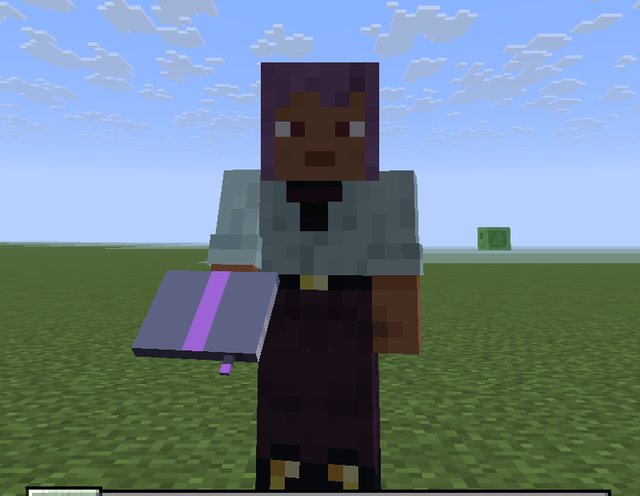
</p>

### Opening it

- **Right-click:** opens the *pinned* tab (see below). With nothing pinned, it opens the Modules page.
- **Sneak + right-click:** always opens the Modules page.
- **Esc** closes the tablet. In an AE2 terminal opened from the tablet, **Esc goes back to the tablet** instead.

### Modules page

Open it with the **gear** at the top right.

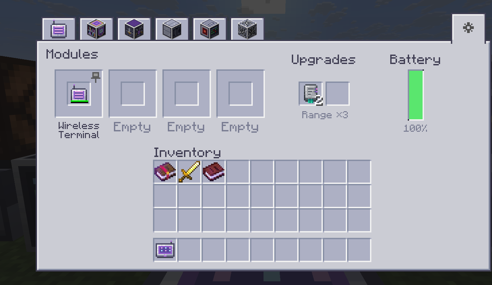

- **Module slots (4):** each terminal you put here gets its own tab. Clicking that tab opens the **real AE2 terminal**, with
  everything it normally does (search, crafting, sorting). The terminal's settings, power and crafting grid are saved back
  into the module.
- **Pin:** click the small pin on a module (or right-click any tab) to make it the tab that opens first. The pinned tab
  has a gold pin. Click again to unpin.

#### Upgrades and battery

- **Upgrades (2 slots):** each AE2 **Wireless Booster** adds the access point's range again (up to 4 per slot), so two
  boosters triple it. An AE2WTLib **Infinity Booster Card** removes the range limit.
- **Battery:** the charge of your terminal module. Charge the terminal in an AE2 Charger as usual.

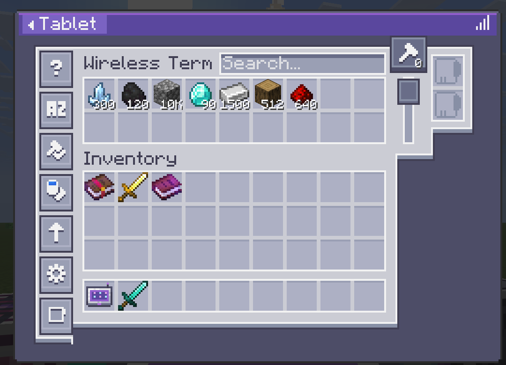

### Storage tabs: Library, Armory and Tools

Each tab shows everything stored in that kind of block across your whole network, in AE2's terminal style.

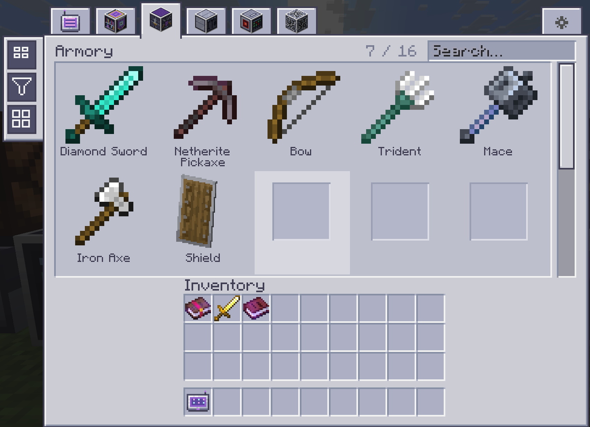

| Action | What happens |
| --- | --- |
| **Click** an item | Picks it up onto your cursor. If you are already holding an item, the two swap. |
| **Shift-click** an item | Moves it into your inventory. |
| **Click** a book (Library tab) | Opens the book to read. Right-click picks it up instead. |
| **Shift-click** an item in your inventory | Stores it in the first free spot on the network. |
| **Click an empty box** while holding an item | Stores the held item. |
| **Scroll** | Scrolls the list. |
| **Search** box | Filters by name. Right-click the box to clear it. |

Only real free spots are drawn as boxes: two Armories holding 7 items show 9 empty boxes. The counter in the header
(`7 / 16`) shows used and total spots.

**Left toolbar:**

- **Sort:** storage order, A–Z or Z–A.
- **Filter:** show or hide the free spots.
- **View size:** Large (5 per row, big icons with names), Medium (8 per row) or Small (17 per row, AE2 size). Each tab
  remembers its own size.

<p>
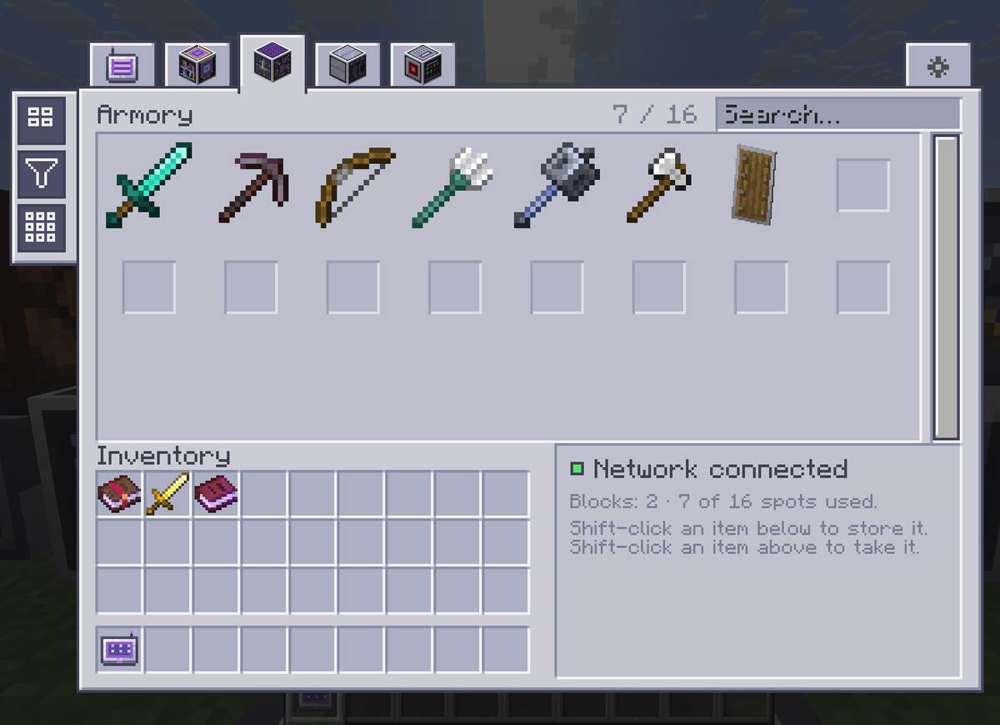
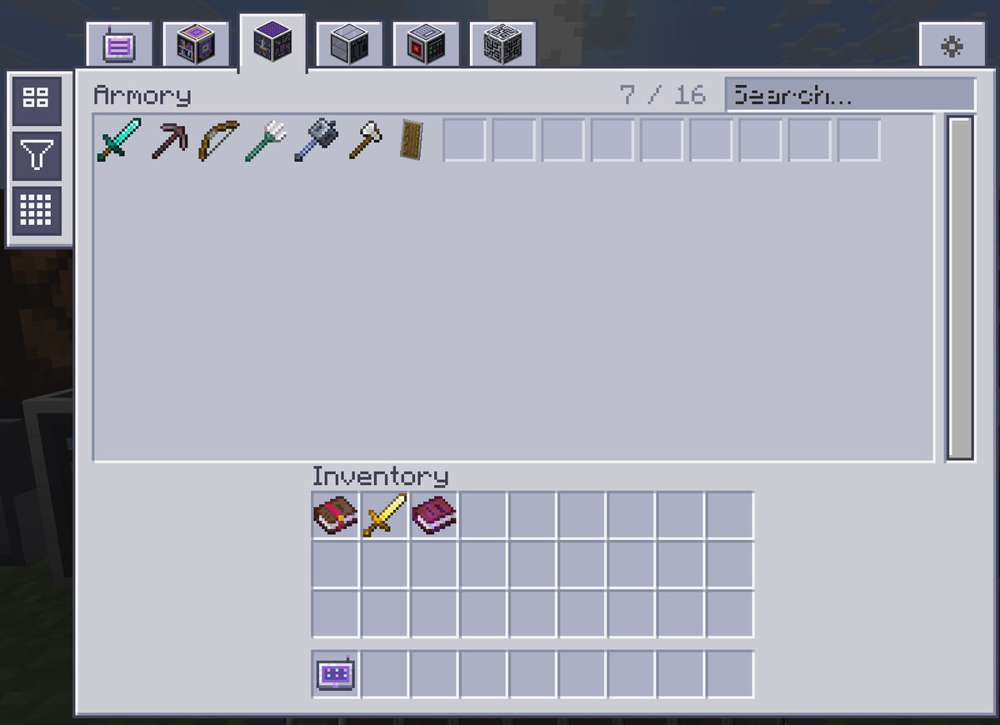
</p>

### Automation tab

See [Farm automation](#farm-automation).

### Devices tab

The **Devices** tab is always there while the tablet reaches a network. It lists every AE2 device on the network,
grouped by kind, much like AE2's Network Status screen, but you can look inside each group and find the blocks.

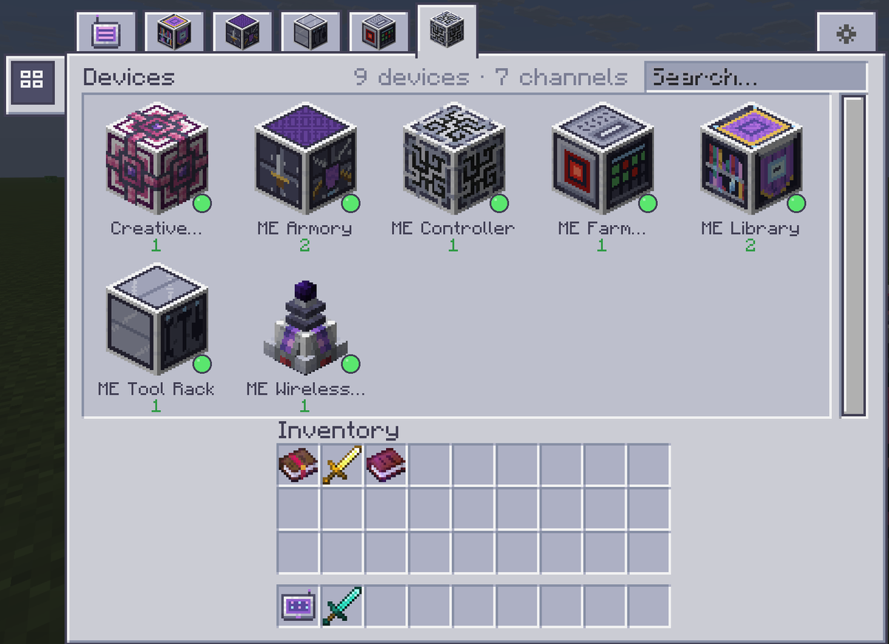

* Each kind shows its icon, how many there are, and a status light: green when all are working, red when any are
  offline (the count of offline ones is shown).
* Click a kind to list each device of it: its position (and dimension when not the Overworld), a state light
  (**Active**, **No channel**, **No power** or **Starting**), the channels it carries and its power use in AE/t.
  Hover a row for full details.

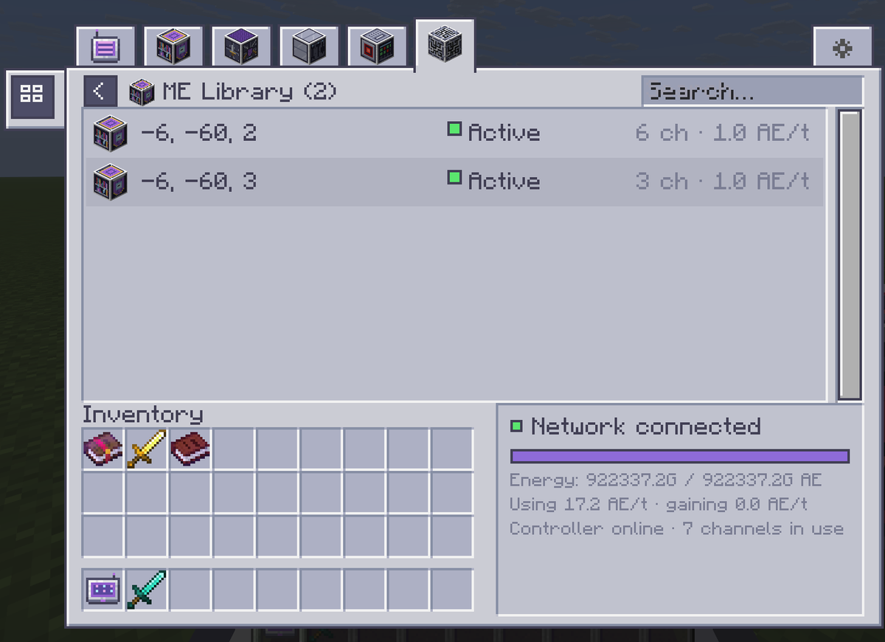

* Click a row to **locate** the device: the tablet tells you its distance and direction, and a beam of light rises
  from it for 10 seconds.
* The sort button orders the list by position, problems first or problems last (A–Z or Z–A for kinds).
  The search box filters by name or position. **<** goes back to the kinds.

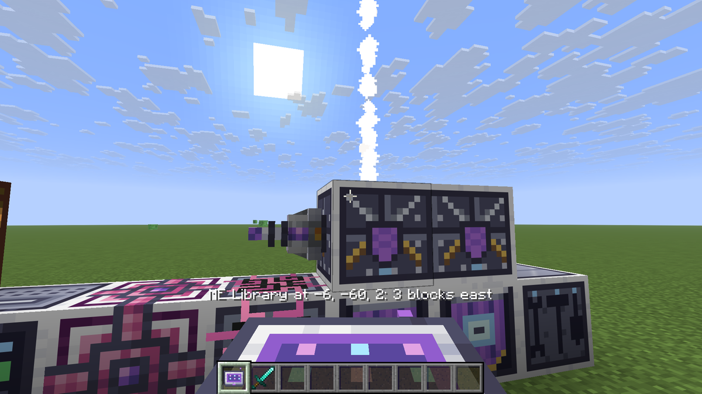

## ME Library

Each ME Library holds **8 guide books** and uses **1 channel**. Libraries that touch pass the network along, so a row of
libraries needs only one cable (up to 8 on a normal cable). The shelves on the sides show how many books are inside, and
the lights glow only while the block has power and a channel.

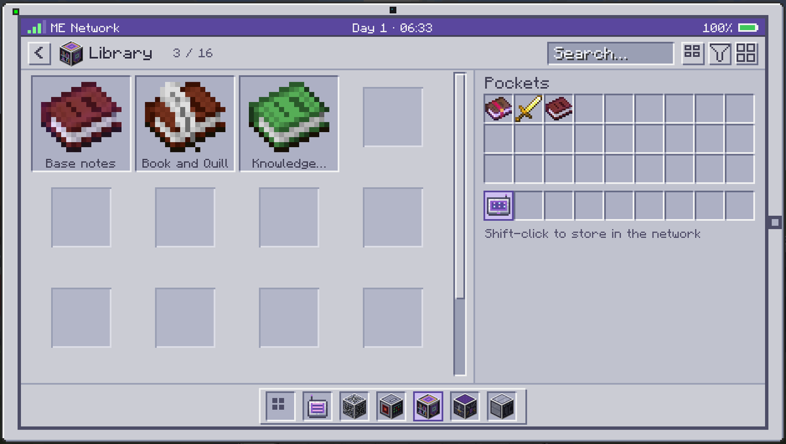

- **Accepted:** guide books from any mod (Patchouli, Modonomicon, GuideME and others), written books and books and quills.
  Items whose name says book, guide, manual, journal, codex, lexicon and so on are accepted too.
- **Not accepted:** blank books, enchanted books and Apothic Enchanting's tomes.
- **Reading:** click a book on the Library tab. Written books open right away; guide books open as if you had
  right-clicked them.
- **Right-click the block** to open its own 8 slots:

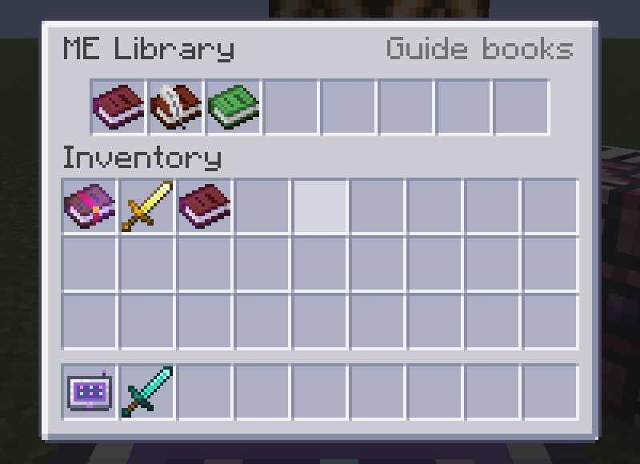

Pack makers can add or block items with the item tags `appliedquartermaster:library_books` and
`appliedquartermaster:library_blocked`.

## ME Armory and ME Tool Rack

- **ME Armory:** 8 weapons and mining tools (swords, axes, pickaxes, shovels, hoes, bows, crossbows, tridents, maces,
  shields, and anything with a tool or weapon component).
- **ME Tool Rack:** 8 utility tools: wrenches, memory cards, network tools and any other single item that is not armour or
  food.
- Each uses **1 channel**. Place several **side by side or stacked, facing the same way**, and their frames merge into
  one cabinet.
- Blocks face you when you place them. Their lights glow only with power and a channel.

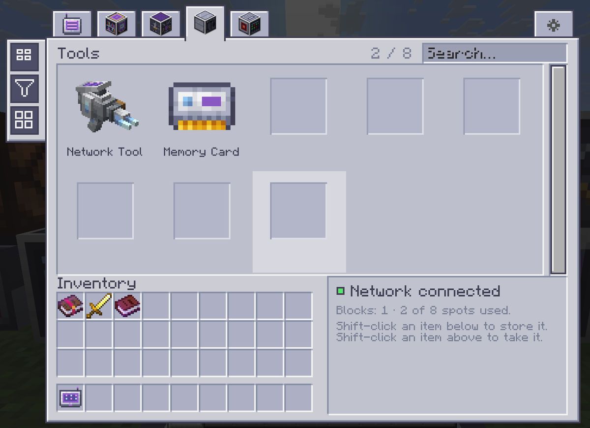

Pack makers can extend them with the item tags `appliedquartermaster:armory_items` and
`appliedquartermaster:tool_rack_items`.

## Farm automation

Switch your farms on and off from anywhere.

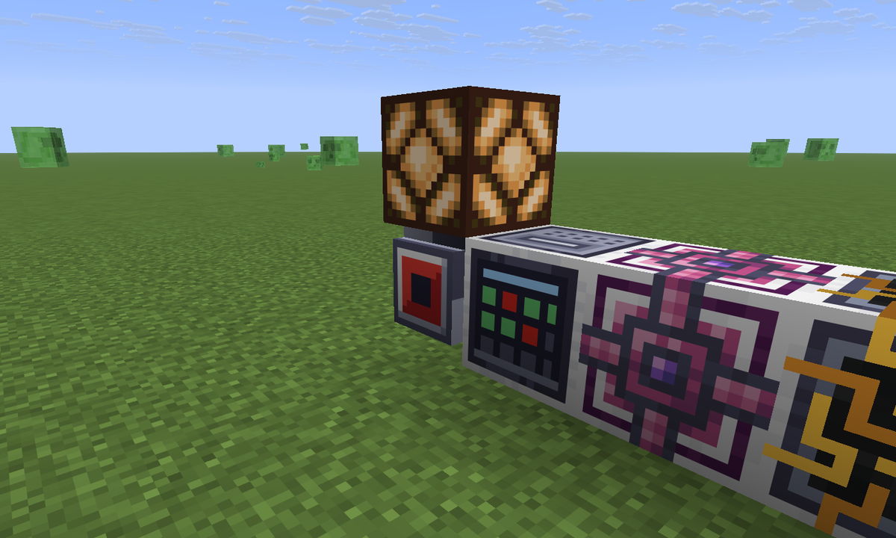

### 1. Place an ME Farm Controller

Seen from the front (the switchboard face):

- the cyan **network ports** on the **back and left** connect to your main ME network and use **1 channel**;
- the red **farm port** on the **right** takes the farm's own cables.

Keep the farm's cables apart from your main network cables. Name the controller in an anvil (or from the tablet) to name
the farm. Right-click it with an empty hand to see the farm's status; sneak-right-click clears its icon.

### 2. Put ME Redstone Plates on the farm cables

Run cables from the farm port to your machines and place **ME Redstone Plates** on them, facing the block you want to
power, the same way you place a P2P tunnel. Up to 6 plates fit around one cable.

- **Green ring:** on. **Red ring:** off. **Dark:** the farm's controller is offline (no power or channel).
- When on, a plate powers the block it faces with a signal of **1 to 15**.
- **Right-click** a plate to switch it. **Sneak-right-click** changes its strength.

### 3. Control farms from the tablet

The **Automation** tab appears when a Farm Controller is on your network.

<p>
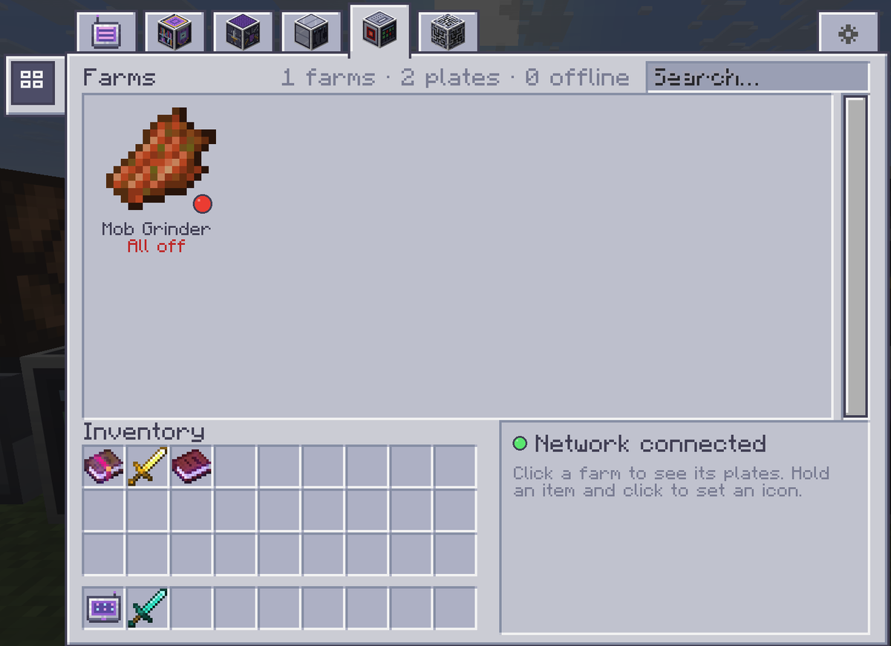
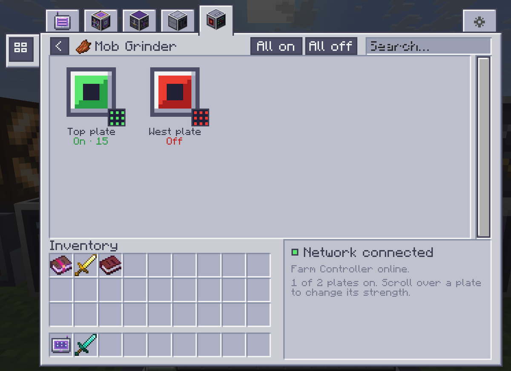
</p>

| Where | Action | What happens |
| --- | --- | --- |
| Farm list | Click a farm | Opens it to show its plates |
| Inside a farm | Click a plate | Switches it on or off |
| Inside a farm | Scroll over a plate | Changes its signal strength |
| Inside a farm | **All on** / **All off** | Switches every plate of the farm |
| Inside a farm | **<** | Goes back to the farm list |
| Anywhere | Right-click a farm or plate | Renames it |
| Anywhere | Click while holding any item | Uses that item as the icon (the item is not used up) |
| Anywhere | Sneak-right-click | Clears the icon |
| With JEI | Drag an item from JEI onto a farm or plate | Uses it as the icon |

Each farm has a **status light**: green when running, red when everything is off or the farm is offline. Plates without
their own icon show their light ring in its current colour. New plates are named after the side they face ("Top plate",
"West plate").

## Recipes

Everything is crafted from AE2 parts.

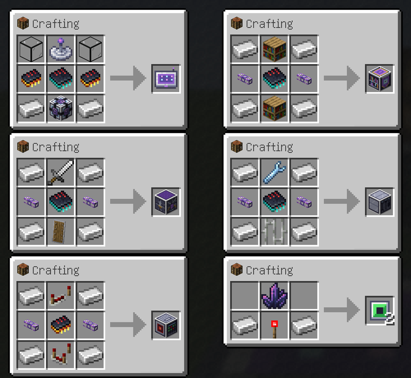

| Item | Main ingredients |
| --- | --- |
| ME Tablet | Wireless receiver, logic and engineering processors, energy cell, quartz glass, iron |
| ME Library | Bookshelves, engineering processor, fluix glass cable, iron |
| ME Armory | Iron sword, shield, engineering processor, fluix glass cable, iron |
| ME Tool Rack | Certus quartz wrench, iron bars, engineering processor, fluix glass cable, iron |
| ME Farm Controller | Repeater, comparator, logic processor, fluix glass cable, iron |
| ME Redstone Plate (×2) | Fluix crystal, redstone torch, iron |

## In-game guide

The mod adds an **Applied Quartermaster** section to AE2's guide, with pages for the tablet, each block, farm automation
and all recipes. Hold **G** (the guide key) over any of the mod's items to jump to its page.

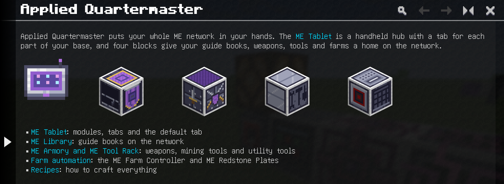

## Troubleshooting

| What you see | Fix |
| --- | --- |
| *Install a Wireless Terminal module…* | Put a wireless terminal in a module slot on the Modules page. |
| *Link the Wireless Terminal module to your network…* | Link the terminal in a Wireless Access Point, then put it back in the tablet. |
| *Out of range…* | Get closer to a powered Wireless Access Point, or add Wireless Boosters to the tablet. |
| *No ME Library (Armory, Tool Rack, Farm Controller) on this network* | Place one on the network the terminal is linked to. |
| A block's lights are off | The block has no power or no channel. A normal cable carries 8 channels. |
| Plates are dark | The Farm Controller is offline: check that its network port has power and a channel. |

## Requirements

| | Version |
| --- | --- |
| Minecraft | 26.1.2 |
| NeoForge | 26.1.2.107 or newer |
| Applied Energistics 2 | 26.1.8-alpha or newer |
| AE2 Wireless Terminals (AE2WTLib) | Optional: universal terminals and the Infinity Booster Card |
| JEI | Optional: drag items onto farms and plates to set their icons |

## Download

Every push builds the mod on GitHub: open the **Actions** tab, pick the latest run and download the
`appliedquartermaster-jar` file. Tagged versions (for example `v0.1.0`) appear under **Releases** with the jar attached.

## Building it yourself

You need **Java 25**.

```
git clone https://github.com/MoosaSharwaan/Applied_Quartermaster.git
cd Applied_Quartermaster
./gradlew build        # Windows: gradlew.bat build
```

The jar appears in `build/libs/`. Put it in your mods folder next to AE2.

### Development self-test

`./gradlew runSelftest` starts the game, builds a small test network in the singleplayer world `aqtest` (create it
first; a superflat world works best) and opens every tablet page and guide page. It checks storing, taking, recipes and
redstone output, saves screenshots to `run/screenshots/aq_*.png` and quits. It is switched off in normal play. The
screenshots in this README come from it.

## Credits and licence

Code and art by MoosaSharwaan. Early design mockups are kept in [`docs/design`](docs/design).
Licensed under the [GNU LGPL v3](LICENSE), the same licence as AE2.
