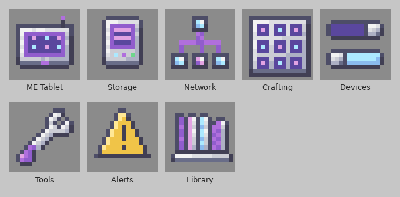
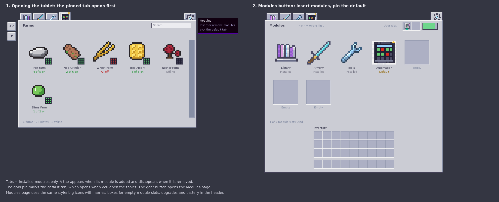
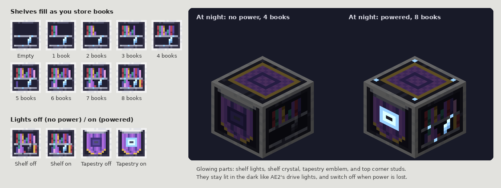
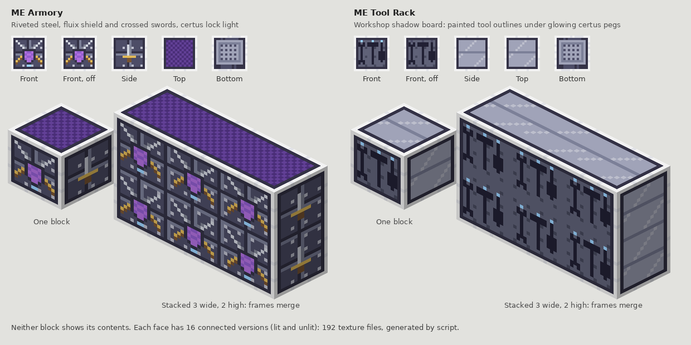
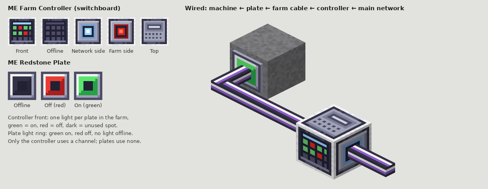
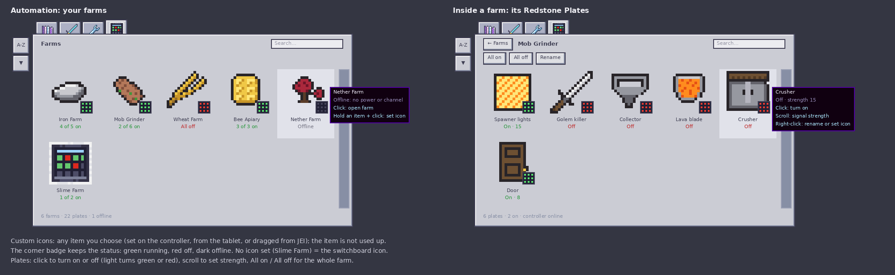

# Applied Quartermaster

An addon for [Applied Energistics 2](https://github.com/AppliedEnergistics/Applied-Energistics-2) that puts your whole ME network in your hands.
The **ME Tablet** is a handheld hub with a tab for each part of your base, and four new blocks give your guide books, weapons, tools and farms a proper home on the network.

> **Status: early development.** The tablet, its modules and the Library, Armory and Tool Rack work on an AE2 network. Farm automation and recipes are next. See the roadmap below.



## Features

### ME Tablet
- Opens straight onto a terminal-style screen with a **tab for each module** you have, plus a **Modules** button.
- **Pin** any tab as the default and the tablet opens on it.
- **Inventory module:** insert an AE2 Wireless Terminal (or Wireless Crafting / universal terminal) and the Inventory tab opens that real AE2 terminal. **Esc** returns to the tablet; Esc in the tablet closes it.
- Library, Armory, Tools and Automation tabs **unlock when their block is on your network**.
- Three view sizes: **Large** (5 per row with names), **Medium** (8 per row) and **Small** (17 per row, AE2 size).
- Held in both hands as a 3D model, with upgrade slots and a battery like a wireless terminal.



### ME Library
Stores **8 guide books** per block and lets you read them from the tablet.
- Works with Patchouli, Modonomicon, GuideME and written books, plus a right-click fallback for any other guide; rejects enchanted books and enchanting tomes.
- Shelves show how many books are stored; lights glow only with power and a channel.
- Uses 1 channel; touching libraries connect to each other without cables.



### ME Armory and ME Tool Rack
Store **8 weapons and mining tools** or **8 utility tools** (wrenches, memory cards, network tools) per block, outside your storage cells.
Swap any of them into your hand from the tablet. Frames merge when you stack them into a wall.



### Farm automation
- **ME Farm Controller:** one per farm; its switchboard shows each switch's state. Network side joins your ME network, farm side runs the farm's own cables.
- **ME Redstone Plate:** a cable part like a P2P tunnel, up to 4 around one cable (6 with top and bottom). Green when on, red when off, dark when offline.
- From the tablet: turn plates on and off, set signal strength, and give farms and plates item icons.




## Requirements

| | Version |
| --- | --- |
| Minecraft | 26.1.2 |
| NeoForge | 26.1.2.107 or newer |
| Applied Energistics 2 | 26.1.8-alpha or newer |
| AE2 Wireless Terminals | Optional |

Built for **All the Mods 11**.

## Download

Every push builds the mod on GitHub: open the **Actions** tab, pick the latest run and download the `appliedquartermaster-jar` file.
Tagged versions (for example `v0.1.0`) appear under **Releases** with the jar attached.

## Building it yourself

You need **Java 25**.

```
git clone https://github.com/MoosaSharwaan/Applied_Quartermaster.git
cd Applied_Quartermaster
./gradlew build        # Windows: gradlew.bat build
```

The jar appears in `build/libs/`. Put it in your mods folder next to AE2.

## Roadmap

1. ~~Tablet item, tabs, Modules page, Inventory module (opens the AE2 terminal).~~ Done.
2. ~~ME Library and the Library tab; ME Armory, ME Tool Rack and their tabs.~~ Done.
3. ME Farm Controller, ME Redstone Plate and the Automation tab.
4. Recipes, guide pages and polish.

## Development self-test

`./gradlew runSelftest` starts the game, builds a small test network in the singleplayer world `aqtest`
(create it first, a superflat world works best), opens every tablet page, saves screenshots to
`run/screenshots/aq_*.png` and quits. It is switched off in normal play.

## Credits and licence

Code and art by MoosaSharwaan. Some mockup images in `docs/` show AE2 item icons for illustration only; they belong to the AE2 team.
Licensed under the [GNU LGPL v3](LICENSE), the same licence as AE2.
